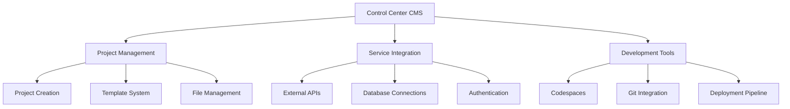

# CMS Documentation

Welcome to the Control Center CMS documentation. This comprehensive guide covers all aspects of our content management system, from basic project management to advanced development workflows.

## What is Control Center CMS?

Control Center CMS is a powerful, developer-friendly content management system designed for modern web development. It provides:

- **Project Management**: Create, organize, and manage multiple projects
- **Service Integration**: Connect various external services and APIs
- **Development Workflows**: Integrated codespaces and development tools
- **Deployment Pipeline**: Automated deployment and hosting solutions

## Getting Started

### Core Features

| Feature | Description | Status |
|---------|-------------|--------|
| **Projects** | Project creation and management | ✅ Active |
| **Services** | External service integrations | ✅ Active |
| **Codespaces** | Integrated development environment | ✅ Active |
| **Templates** | Pre-built project templates | ✅ Active |
| **Deployment** | Automated deployment pipeline | ✅ Active |

### Quick Navigation

- **[Projects](./projects)** - Learn how to create and manage projects
- **[Services](./services)** - Integrate external services into your projects
- **[Codespaces](./codespaces)** - Use the integrated development environment

## System Architecture

## Key Benefits

### For Developers
- **Rapid Development**: Pre-configured environments and templates
- **Integrated Workflow**: Everything from coding to deployment in one place
- **Service Integration**: Easy connection to external APIs and services
- **Version Control**: Built-in Git integration

### For Teams
- **Collaboration**: Shared codespaces and project management
- **Standardization**: Consistent development environments
- **Scalability**: Handle multiple projects efficiently
- **Monitoring**: Real-time project status and metrics

## Support & Resources

- **Documentation**: Comprehensive guides for all features
- **Community**: Join our developer community
- **Support**: Get help from our support team
- **Updates**: Stay informed about new features and updates

Ready to get started? Check out our [Projects](./projects) guide to create your first project!
